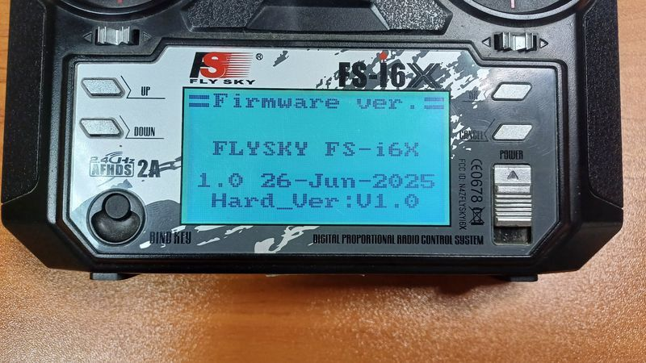

# FlySky FS-i6X Firmware Bug Fix

## Why is this needed?

The FlySky-i6X's official firmware has a bug which is decreasing its performance. It is not a hardware problem, but a software mistake. Unfortunately FlySky never addressed that bug with an official update. I tried on several occasions to get in contact with them and to ask them if they are even aware of the problem, but I never got any response back.

The effect of this bug is not so pronounced that it makes the radio unusable (obviously). It is also technical enough that its nature can be grasped only when working with blackbox logs and applying some observation. For the average user it is simply the case that this radio seems to be _not_ of high enough quality compared to others.

This firmware patch will not give your radio "superpowers" but it will simply make it work _as it was originally designed to_.

This is how a single channel's data looks like before (with original firmware) and after (with bugfix):

> The problem is much more pronounced when using a digital protocol (IBUS or SBUS). PPM is not affected that much because by its nature it has lower frame rate than digital protocols.

If you just want to install the update head over to the [How to flash](#how-to-flash) section.

If you are interested in the details - read on.

### The problem

The radio data from the transmitter is sent over 2.4GHz in _frames_ (_packets_) of information. Each frame is a short sequence of binary data. There are different types of frames, carrying different kinds of information. The most important and most frequently sent frame type is the one that carries the _channel data_. These frames are sent at approximately 7 milliseconds interval (which is actually one of the best frame rates, compared to other radio brands).

The problem is that although frames are sent every 7ms, most of the time we receive several frames which carry the _same channel data_!

See this graph:

This is just the first channel (roll). The rectangles represent the channel's value as it arrives with each frame. On the X axis we have time, on Y - the channel value [1000 - 2000]. Note how several consecutive frames carry the same channel value.

In many cases this is not necessarily a problem. It simply means that the effective frame rate is lower. For example instead of getting fresh channel data every 7ms, you get it every 14 or 21ms.

If you are flying airplanes or some other not-so-sensitive craft you might never sense a problem.

The problem becomes more pronounced when the radio is used for higher-performance quad copters for example.

Flight Controller software (Cleanflight, Betaflight) can detect quick movements of the sticks and apply further boost to the motors. This is much used in racing because it can provide more crisp and responsive behavior of the copter.

In former versions this feature was called _Setpoint Weight_, now it has been extracted as the F (Feedforward) gain of the PID loop. The Feedforward component is a direct _derivative_ of the stick movement - if your stick is stationary F is zero, if your stick is moving F rises. The faster you move the stick, the higher F's value is (the sign of F depends on the _direction_ you are moving the stick).

In the early days of flight controller software this has posed a problem: as we are using digital radio protocols and the channel data arrives in frames, channel values stay the same most of the time (between two frames) and then _jump_ to their new values when a new frame arrives. This does not work very well with F, because in the time between frames, when channel values stay the same, F should be zero. On the other hand, when new frame with different channel value arrives, F reacts to the _change_ and a _F kick_ is produced. On the next iteration of the PID loop F drops to zero again because channel data once again stays the same until the next frame.

For this reason radio channel _interpolation_ was implemented (and later a low pass filter) - the software tries to smooth out the "staircase" shape of the axis values, so that the derivative is also smooth and F kicks are avoided.

The following graph illustrates all this:

It represents one channel (roll in the example). The curves are:
* `debug[0]` is the _raw_ radio data. Notice how it jumps to new values as new frames arrive.
* `RC Command` is the above radio data but after the interpolation/smoothing filter has been applied.
* `Feedforward` is the _derivative_ of the above. Note that where `RC Command` is not changing (it is horizontal) F is zero and where `RC Command` is changing F has a value (the steeper the change of `RC Command`, the higher the value of F).

As it's visible, the step-like shape of the `RC Command` produces _F kicks_ which can be quite significant. They translate to very erratic commands to the motors (they are asked very rapidly to increase speed then to reduce and so on) which decreases their effectiveness, increases heat and mechanical stress.

Although this problem affects F the most, P is not immune to it either:

We can see that P constantly changes direction while trying to keep the copter in sync with the stair case shaped commands.

### So if the raw radio data passes through smoothing filter why is it still so step-like?

The answer lies in the way the software configures the smoothing filter. By default the amount of smoothing is determined automatically based on the interval at which channel frames arrive (the frame rate). With FS-i6X this is about 7ms and the filter is setup in such a way that it has to "connect the dots" of two frames.
> Keep in mind that when using filtering the `RC Command` curve is about one-frame-time behind of the actual radio data. This is because in realtime the flight controller does not know if it has to smooth the current value up or down until it sees the next frame. That's why interpolation/filtering always introduces some delay.

Here with red we can see the actual frames (and because of the bug, several consecutive frames have the same value). As we can see the filter actually does pretty good job in smoothing out the curve _between two frames_. And here _"between two frames"_ is the key. Consider two frames with the same value - the smoothing actually works there, they are connected with a straight line - there's no reason for the filter to make a curvy line between points of the same value!

In other words, from the filter's perspective there's no way to know that the arriving frame's data is _wrong_ - it looks like perfectly valid channel data (maybe we are somehow really moving our sticks in such a way) and it does its best to smooth out the line _between any two frames_.

### The fix
The firmware patch provided here fixes the software bug in the original firmware and sends the _actual_ axes values at _every frame_. Here's the result:

Now the automatic RC filter achieves the desired effect and the F kicks are no longer present.

> For more technical description of the fix see the [source code](src/chan_hack.c)

## How to flash

1. Head over to the [releases](../../releases) section and download the *bugfix* updater program. Just in case, the original firmware is also provided.

2. You need a special cable. It _might_ be included in your box but mine, for example, came with no cable. In such a case you can either buy one or you can create one yourself. Unlike the FS-i6, which uses UART communication, the FS-i6X uses USB:

3. Connect the cable and open the `System`/`Firmware update` menu on your transmitter. Confirm that you want to enter the firmware update mode.

4. Open the updater program. You should see the device detected:

> If nothing appears in the updater you can try to put your radio in firmware updata mode by using this combination:
> 1. Turn off your radio
> 2. Hold simultaneously the _left horizontal_ trimmer to the _right_ and the _left vertical_ trimmer _down_
> 3. Turn on your radio
>
> 

5. Click `Update`

6. After the transmitter is restarted you can make sure the new version is active from the `System`/`Firmware ver.` menu:

7. Enjoy!

## Like it?

If having the full potential of your device brought a smile on your face, you may shine back if you feel like it: \
Thank you!!!
